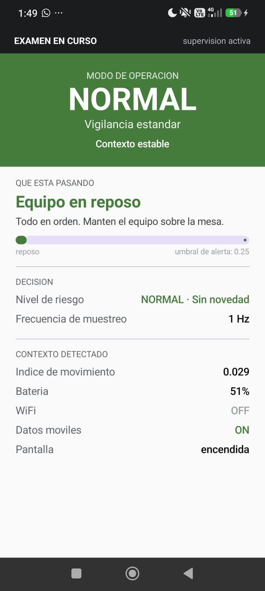
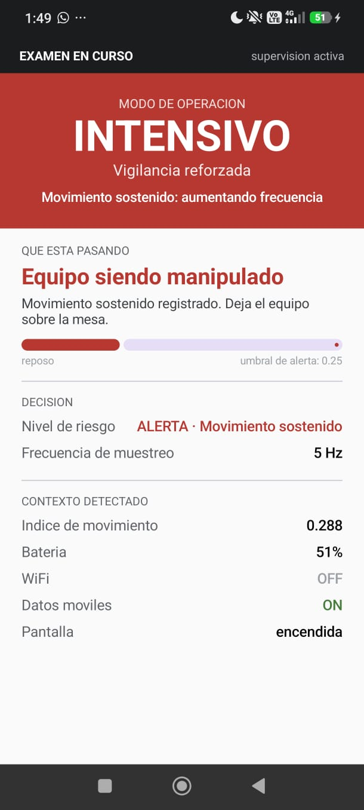
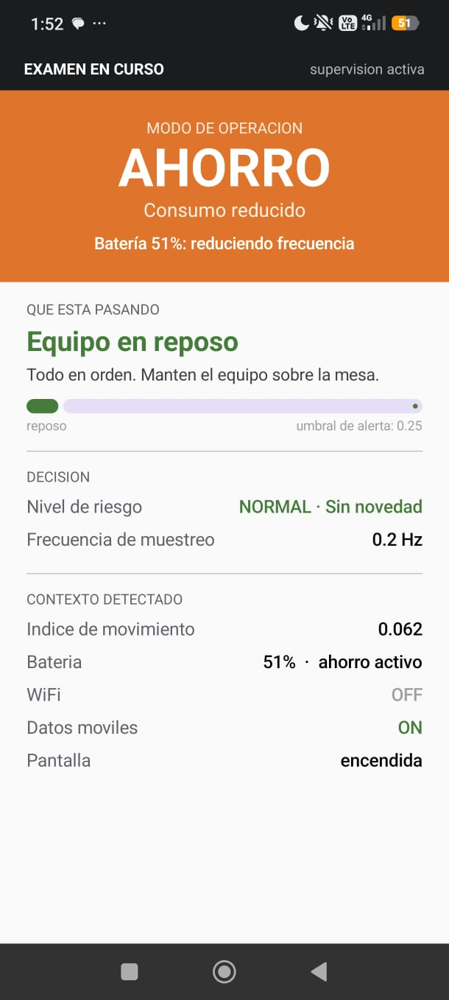
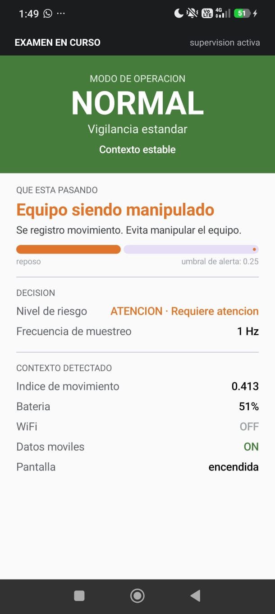

# VIGÍA

Aplicación Android que **detecta el contexto del propio dispositivo y adapta
automáticamente su comportamiento de sensado**, sin intervención del usuario.

Es la aplicación del alumno dentro de un sistema de monitoreo de exámenes:
observa cuánto se mueve el equipo, cuánta batería le queda, por dónde está
conectado y si la pantalla está encendida; con eso decide un nivel de riesgo y
un modo de operación, y cambia la frecuencia con la que muestrea sus sensores.

**Taller 1 — Desarrollo Adaptativo e Integración de Sistemas · UNI 2026-2**

---

## Capturas

| Modo NORMAL | Modo INTENSIVO | Modo AHORRO |
|---|---|---|
|  |  |  |
| Equipo en reposo, 1 Hz | Movimiento sostenido, 5 Hz | Ahorro de bateria, 0.2 Hz |

### El tiempo sostenido en accion



El indice de movimiento ya cruzo el umbral de alerta (0.413 sobre 0.25), pero el
riesgo sigue en `ATENCION` y el modo en `NORMAL`: el movimiento todavia no lleva
`SUSTAINED_MS` sostenido. El sistema distingue un golpe puntual de una
manipulacion real.

---

## Comportamiento adaptativo

| | Disparador | Efecto |
|---|---|---|
| **A1** | Movimiento sostenido con la pantalla encendida | Modo `INTENSIVO`: sube la frecuencia de muestreo a 5 Hz |
| **A2** | Batería < 15 % o ahorro de energía del sistema | Modo `AHORRO`: baja la frecuencia a 0.2 Hz |

Los cuatro modos son `NORMAL`, `INTENSIVO`, `AHORRO` y `DESCONECTADO`.
La pantalla muestra en todo momento el modo activo, el motivo del último cambio
y la frecuencia de muestreo vigente.

---

## Requisitos

- **Android 8.0 (API 26) o superior**
- **Celular físico.** El emulador no sirve: no tiene acelerómetro real ni
  reporta el modo de ahorro de energía del sistema.
- Android Studio con JDK 11 o superior

---

## Instalación

```bash
git clone https://github.com/Kygarde/vigia-taller1.git
cd vigia-taller1
```

Abrir la carpeta en Android Studio y esperar el *Gradle Sync*.

> ⚠️ **La ruta del proyecto no puede tener tildes, ñ ni caracteres especiales.**
> El plugin de Android para Gradle falla con
> `Your project path contains non-ASCII characters`.
> Por ejemplo, `.../Integración de Sistemas/...` no funciona; hay que renombrar
> la carpeta a `Integracion`.

Luego, en el celular:

1. Ajustes → Acerca del teléfono → tocar 7 veces **Número de compilación**
   (en Xiaomi/HyperOS: **Versión del sistema operativo**)
2. Opciones de desarrollador → activar **Depuración USB** y, en Xiaomi,
   también **Instalar vía USB**
3. Conectar por cable y aceptar el diálogo de depuración
4. Seleccionar el dispositivo en Android Studio y pulsar **Run ▶**

---

## Cómo provocar cada adaptación

Esta es la sección importante: cualquier persona debe poder reproducir las dos
adaptaciones sin ayuda del equipo.

### A1 — Modo INTENSIVO

1. Abrir la app y dejar el celular quieto sobre la mesa unos 10 segundos.
   Debe mostrar modo **`NORMAL`**, movimiento por debajo de 0.10 y frecuencia
   **1 Hz**.
2. **Agitar el celular durante unos 3 segundos**, con la pantalla encendida.
3. El riesgo pasa a `ALERTA` y el modo cambia solo a **`INTENSIVO`**.
   La frecuencia sube a **5 Hz** y el motivo en pantalla dice
   *"Movimiento sostenido: aumentando frecuencia"*.
4. Dejarlo quieto otra vez. Vuelve a `NORMAL` después de unos **5 segundos**.

> **Por qué tarda en volver:** hay una histéresis de 5 s que bloquea cambios de
> modo consecutivos. Sin ella, el modo oscilaría sin parar cuando el contexto
> queda justo en el umbral.

> **La pantalla debe estar encendida.** Agitar el celular con la pantalla
> apagada no eleva el riesgo: es ruido de alguien caminando con el equipo en el
> bolsillo, no un indicio útil.

### A2 — Modo AHORRO

1. **Desconectar el celular del cable USB.**
2. Activar el **ahorro de batería** del sistema desde la barra de notificaciones.
3. El modo cambia a **`AHORRO`** y la frecuencia baja a **0.2 Hz**. El motivo
   muestra el nivel real de batería.
4. Desactivar el ahorro para volver a `NORMAL`.

> ⚠️ **Tiene que estar desconectado del cargador.** Android desactiva el ahorro
> de batería mientras el equipo se está cargando, así que enchufado esta
> adaptación no se dispara y parece que la app falla.

También se activa solo cuando la batería baja del **15 %**.

### Sensado en segundo plano

Con la app abierta aparece una notificación permanente **"VIGÍA activo"**.
Minimizar la app (sin cerrarla), esperar dos minutos y volver: el modo y los
valores siguieron actualizándose. Es el `MonitoringService`, un servicio en
primer plano; sin él Android suspende la app y el sensado se detiene.

### Panel del docente

La misma app trae las dos vistas. El botón **Panel docente**, arriba a la derecha,
cambia entre ellas: se instala el mismo APK en los dos equipos, uno se queda como
alumno y el otro entra al panel.

1. Bluetooth encendido en ambos equipos y permisos concedidos
2. Los dos deben tener el **mismo código de aula** (el chip `AULA nnn` de la barra superior)
3. El equipo del alumno queda en su pantalla; el otro entra a **Panel docente**
4. El panel lista los equipos que están transmitiendo, ordenados por nivel de riesgo

No hay emparejamiento ni conexión. El equipo del alumno **anuncia** su estado y el
del docente **escucha**: es advertising BLE, sin conexión. Android admite alrededor
de siete conexiones GATT simultáneas, así que conectarse a cada alumno no escalaría
a un salón completo; el advertising sí.

El intervalo de emisión lo fija el modo activo, igual que la frecuencia del sensor:

| Modo | Anuncia cada |
|---|---|
| `NORMAL` | 1 s |
| `INTENSIVO` | 200 ms |
| `AHORRO` | 5 s |

Un equipo que deja de anunciar desaparece de la lista a los 15 segundos.

### Código de aula

Cada anuncio lleva un código de aula y el panel descarta los que no coinciden. Es
lo que evita que dos salones vecinos usando la app se mezclen en la misma lista.

Se cambia tocando el chip `AULA nnn` de la barra superior, y queda guardado en el
equipo. El valor por defecto es **101**.

> Es un separador operativo, no un control de seguridad: un alumno con acceso al
> código podría cambiarlo. En un despliegue real lo emitiría la app del docente al
> iniciar la sesión de examen.

### Ajustar los umbrales

Todos los valores viven en un solo archivo:
`app/src/main/java/com/vigia/decision/AdaptationRules.kt`

| Constante | Qué controla |
|---|---|
| `MOVEMENT_ALERTA` | Cuánto movimiento hace falta para llegar a `ALERTA` |
| `MOVEMENT_ATENCION` | Umbral del nivel intermedio |
| `SUSTAINED_MS` | Cuánto debe sostenerse el movimiento |
| `NORMALIZATION_CEILING` | Escala del índice de movimiento |
| `BATTERY_LOW` | Porcentaje de batería que dispara `AHORRO` |
| `HYSTERESIS_MS` | Tiempo mínimo entre cambios de modo |

---

## Permisos

| Permiso | Para qué | Cuándo se solicita |
|---|---|---|
| `FOREGROUND_SERVICE` · `FOREGROUND_SERVICE_DATA_SYNC` | Mantener el sensado con la app minimizada | Automático |
| `POST_NOTIFICATIONS` | Notificación del servicio de monitoreo | Al abrir la app |
| `ACCESS_NETWORK_STATE` | Detectar wifi y datos móviles | Automático |
| `BLUETOOTH_ADVERTISE` · `BLUETOOTH_SCAN` · `BLUETOOTH_CONNECT` | Anunciar el estado al panel del docente y escucharlo | Al abrir la app |
| `ACCESS_FINE_LOCATION` | Solo en Android 11 o anterior, que exigía ubicación para escanear BLE | Solo en esos equipos |

En Android 12 en adelante el permiso de escaneo lleva la bandera
`neverForLocation`: la app declara explícitamente que no usa el Bluetooth para
deducir dónde está el alumno.

### Privacidad

VIGÍA no captura pantalla, audio, ubicación GPS ni contenido de aplicaciones.
Procesa únicamente metadatos derivados de sensores del propio dispositivo, y
muestra en todo momento su modo de operación y el motivo de cada cambio.

Lo único que sale del equipo son 9 bytes por anuncio: un identificador derivado
del dispositivo (no de la persona), el código de aula, el nivel de riesgo, el
índice de movimiento, la batería, el modo y tres banderas de conectividad. La
pantalla del alumno indica en todo momento si está transmitiendo o no.

---

## Estructura del código

```
sensing/      →   processing/   →   decision/     →   adaptation/ + ui/
CONTEXTO          PROCESAMIENTO     DECISIÓN          ADAPTACIÓN
4 providers       ventana + EMA     riesgo + modo     frecuencia + pantalla
```

| Etapa | Archivos |
|---|---|
| Captura del contexto | `sensing/AccelerometerProvider.kt`, `BatteryProvider.kt`, `ConnectivityProvider.kt`, `ScreenStateProvider.kt` |
| Procesamiento | `processing/ContextManager.kt`, `processing/SignalProcessor.kt` |
| Decisión | `decision/AdaptationEngine.kt`, `decision/AdaptationRules.kt`, `decision/RiskEvaluator.kt` |
| Adaptación | `adaptation/SamplingPolicy.kt`, `ui/StudentScreen.kt` |
| Modelo de datos | `model/Model.kt` |
| Transporte | `transport/PacketCodec.kt`, `transport/BleAdvertiser.kt`, `transport/BleScanner.kt` |
| Panel del docente | `ui/TeacherScreen.kt` |
| Robustez | `MonitoringService.kt` |

**Tecnologías:** Kotlin · Jetpack Compose · Coroutines/Flow · SensorManager · BLE Advertising

---

## Integrantes

| Integrante | Módulos |
|---|---|
| **Cesar Alonso Dionicio Achachagua** | `sensing/` — captura de contexto · `MonitoringService` |
| **Ernesto Ramon Salazar Ramos** | `processing/` y `decision/` — procesamiento y decisión |
| **Giancarlo Aguirre Alvarado** | `adaptation/` y `ui/` — política de muestreo e interfaz |
