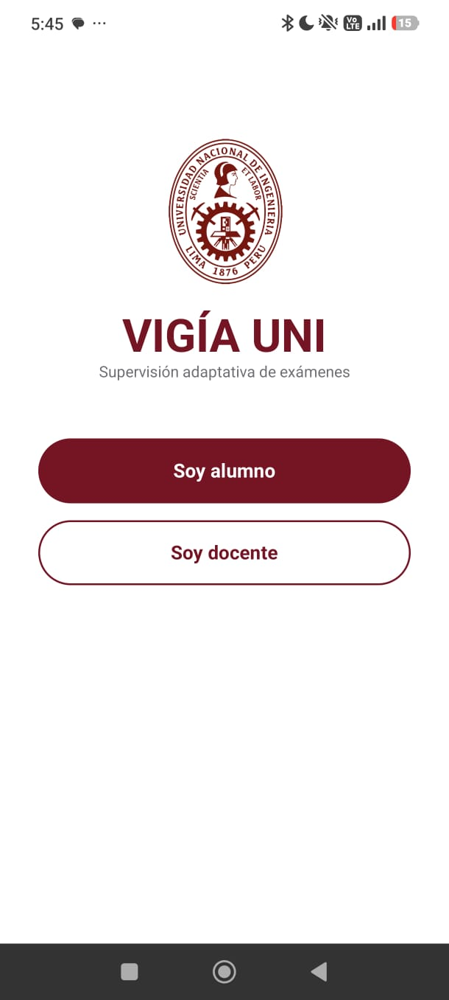
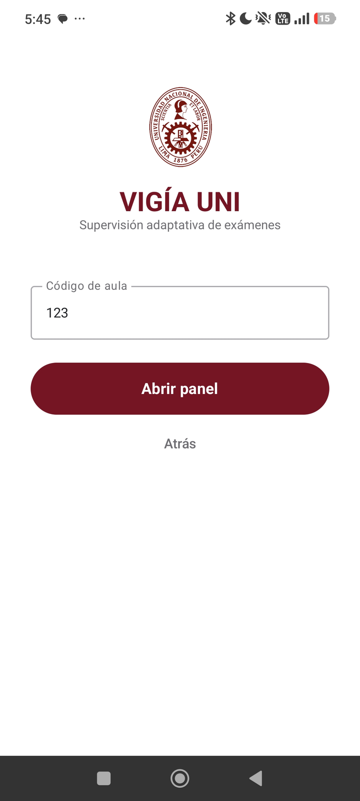
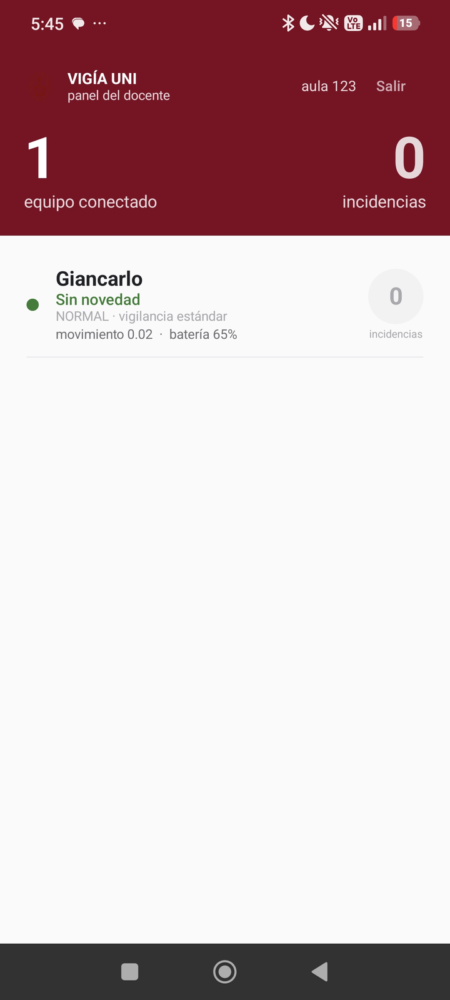
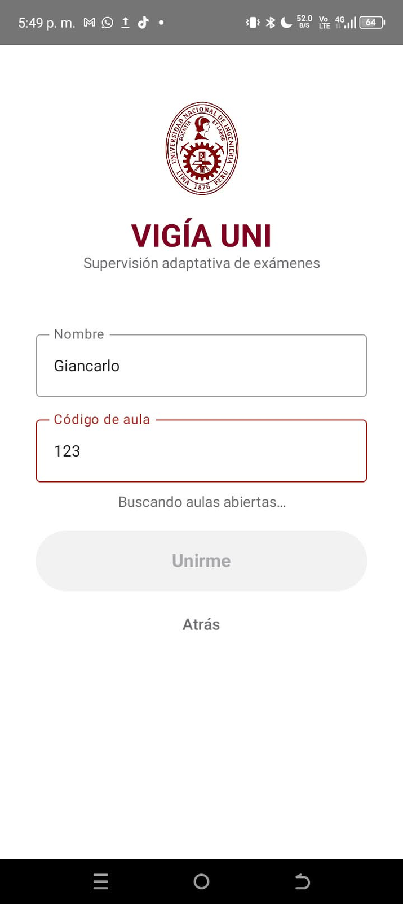
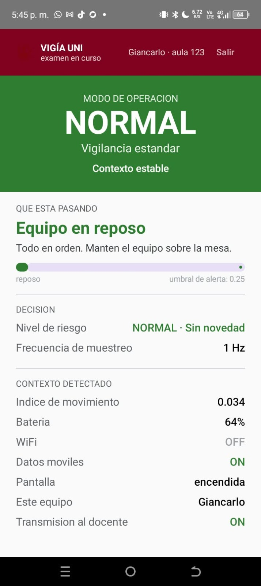

# VIGÍA UNI

Aplicación Android que **detecta el contexto del propio dispositivo y adapta
automáticamente su comportamiento de sensado**, sin que el usuario configure nada.

Es la aplicación del alumno dentro de un sistema de monitoreo de exámenes: observa
cuánto se mueve el equipo, cuánta batería le queda, por dónde está conectado y si la
pantalla está encendida; con eso decide un nivel de riesgo y un modo de operación,
cambia la frecuencia con la que muestrea sus sensores, y anuncia su estado al panel
del docente por Bluetooth.

**Taller 1 — Desarrollo Adaptativo e Integración de Sistemas · UNI 2026-2**

---

## Índice

1. [Capturas](#capturas)
2. [Qué hace](#qué-hace)
3. [Requisitos](#requisitos)
4. [Instalación](#instalación)
5. [Cómo se usa](#cómo-se-usa)
6. [Cómo provocar cada adaptación](#cómo-provocar-cada-adaptación)
7. [Transporte BLE](#transporte-ble)
8. [Permisos](#permisos)
9. [Arquitectura](#arquitectura)
10. [Ajustar los umbrales](#ajustar-los-umbrales)
11. [Problemas frecuentes](#problemas-frecuentes)
12. [Integrantes](#integrantes)

---

## Capturas

### El recorrido, de principio a fin

| 1. Elegir rol | 2. El docente abre el aula | 3. El panel escucha |
|---|---|---|
|  |  |  |
| Alumno o docente | Dicta el código al salón | Los alumnos aparecen al unirse |

| 4. El alumno se une | 5. Monitoreo en curso |
|---|---|
|  |  |
| **Unirme** sigue bloqueado hasta escuchar el aula | Modo, contexto y `Transmisión al docente: ON` |

La cuarta captura muestra la validación funcionando: el código está escrito pero el
equipo todavía no ha escuchado la baliza de esa aula, así que el botón permanece
deshabilitado. **Un aula solo existe mientras el docente la está anunciando.**

### Los tres modos

| Modo NORMAL | Modo INTENSIVO | Modo AHORRO |
|---|---|---|
|  |  |  |
| Equipo en reposo, 1 Hz | Movimiento sostenido, 5 Hz | Ahorro de batería, 0.2 Hz |

### El tiempo sostenido en acción


El índice de movimiento ya cruzó el umbral de alerta (0.413 sobre 0.25), pero el
riesgo sigue en `ATENCION` y el modo en `NORMAL`: el movimiento todavía no lleva
`SUSTAINED_MS` sostenido. El sistema distingue un golpe puntual de una manipulación
real.

---

## Qué hace

### Comportamiento adaptativo

| | Condición detectada | Adaptación automática |
|---|---|---|
| **A1** | Movimiento sostenido con la pantalla encendida | Modo `INTENSIVO`: sube el muestreo a 5 Hz y la emisión BLE a 200 ms |
| **A2** | Batería < 15 % o ahorro de energía del sistema | Modo `AHORRO`: baja el muestreo a 0.2 Hz y la emisión a 5 s |

Los cuatro modos son `NORMAL`, `INTENSIVO`, `AHORRO` y `DESCONECTADO`. La pantalla
muestra en todo momento el modo activo, el motivo del último cambio y la frecuencia
de muestreo vigente.

Nada de esto lo activa el usuario: la condición la detecta el software, la decisión
se produce sola y el efecto es observable en pantalla.

### El pipeline

```
CONTEXTO      →   PROCESAMIENTO   →   DECISIÓN        →   ADAPTACIÓN
sensing/          processing/         decision/           adaptation/ + ui/
4 providers       ventana + EMA       riesgo + modo       frecuencia + pantalla
                                                          transport/
                                                          anuncio BLE
```

---

## Requisitos

- **Android 8.0 (API 26) o superior**
- **Celular físico.** El emulador no sirve: no tiene acelerómetro real ni reporta el
  modo de ahorro de energía del sistema.
- **Bluetooth** para el panel del docente. La app funciona sin él, pero sin transmitir.
- **Dos equipos** para probar el panel: uno como alumno y otro como docente.
- Android Studio con JDK 11 o superior

---

## Instalación

```bash
git clone https://github.com/Kygarde/vigia-taller1.git
cd vigia-taller1
```

Abrir la carpeta en Android Studio y esperar el *Gradle Sync*.

> ⚠️ **La ruta del proyecto no puede tener tildes, ñ ni caracteres especiales.**
> El plugin de Android para Gradle falla con
> `Your project path contains non-ASCII characters`.
> Por ejemplo, `.../Integración de Sistemas/...` no funciona; hay que renombrar la
> carpeta a `Integracion`.

Luego, en el celular:

1. Ajustes → Acerca del teléfono → tocar 7 veces **Número de compilación**
   (en Xiaomi/HyperOS: **Versión del sistema operativo**)
2. Opciones de desarrollador → activar **Depuración USB** y, en Xiaomi,
   también **Instalar vía USB**
3. Conectar por cable y aceptar el diálogo de depuración
4. Seleccionar el dispositivo en Android Studio y pulsar **Run ▶**

### Instalar en un segundo equipo

**Build → Build Bundle(s) / APK(s) → Build APK(s)**. El archivo queda en
`app/build/outputs/apk/debug/app-debug.apk` y se puede compartir e instalar
directamente, sin Android Studio.

> ⚠️ **Los dos equipos deben tener la misma versión de la app.** El paquete BLE va
> por la versión 4 y los anuncios de versiones anteriores se descartan. Un APK viejo
> en uno de los equipos hace que el otro no lo vea, sin ningún mensaje de error.

---

## Cómo se usa

La app abre en una pantalla de inicio donde se elige el rol.

```
                 VIGÍA UNI
        ┌────────────┴────────────┐
    Soy alumno              Soy docente
        │                        │
  nombre + código            código de aula
        │                        │
     Unirme                 Abrir panel
        │                        │
 Pantalla del alumno      Panel del docente
```

**1. El docente abre el aula.** *Soy docente* → escribe un código (por ejemplo `204`)
→ **Abrir panel**. Su equipo empieza a anunciar que esa aula está abierta.

**2. Dicta el código** al salón.

**3. Cada alumno se une.** *Soy alumno* → su nombre → el código → **Unirme**.

El botón *Unirme* permanece bloqueado hasta que la app **escucha** el aula. Un aula
solo existe mientras el equipo del docente la está anunciando: no hay servidor donde
consultarla.

**4. El panel lista a los alumnos** conforme se unen, ordenados por nivel de riesgo.

### Qué muestra el panel del docente


| Elemento | Significado |
|---|---|
| Equipos conectados | Cuántos alumnos están transmitiendo ahora |
| Incidencias | Total de veces que algún alumno entró en `ALERTA` |
| Usando ahora | Cuántos están en `ALERTA` en este momento |
| Contador por alumno | Sus incidencias durante la sesión |

Una **incidencia** es una *entrada* en `ALERTA`, no cada anuncio recibido en ese
estado. En modo `INTENSIVO` el equipo anuncia cada 200 ms: contando anuncios, agitar
el equipo diez segundos sumaría cincuenta puntos. Contando transiciones, es **1**.

El conteo lo lleva el equipo del docente, no viaja en el paquete: así no depende de
lo que el alumno decida anunciar. Se mantiene aunque el alumno salga del alcance y
vuelva, y se reinicia al cerrar el panel.

---

## Cómo provocar cada adaptación

Esta es la sección importante: cualquier persona debe poder reproducir las dos
adaptaciones sin ayuda del equipo.

### A1 — Modo INTENSIVO

1. Entrar como alumno y dejar el equipo quieto sobre la mesa unos 10 segundos.
   Debe mostrar modo **`NORMAL`**, movimiento por debajo de 0.10 y frecuencia **1 Hz**.
2. **Tomar el equipo y moverlo durante unos 3 segundos**, con la pantalla encendida.
3. El riesgo pasa a `ALERTA` y el modo cambia solo a **`INTENSIVO`**. La frecuencia
   sube a **5 Hz** y el motivo en pantalla dice
   *"Movimiento sostenido: aumentando frecuencia"*.
4. Dejarlo quieto otra vez. Vuelve a `NORMAL` después de unos **5 segundos**.

> **Por qué tarda en volver:** hay una histéresis de 5 s que bloquea cambios de modo
> consecutivos. Sin ella, el modo oscilaría sin parar cuando el contexto queda justo
> en el umbral.

> **La pantalla debe estar encendida.** Agitar el equipo con la pantalla apagada no
> eleva el riesgo: es ruido de alguien caminando con el celular en el bolsillo, no un
> indicio útil.

### A2 — Modo AHORRO

1. **Desconectar el equipo del cable USB.**
2. Activar el **ahorro de batería** del sistema desde la barra de notificaciones.
3. El modo cambia a **`AHORRO`** y la frecuencia baja a **0.2 Hz**. El motivo muestra
   el nivel real de batería.
4. Desactivar el ahorro para volver a `NORMAL`.

> ⚠️ **Tiene que estar desconectado del cargador.** Android desactiva el ahorro de
> batería mientras el equipo se está cargando, así que enchufado esta adaptación no
> se dispara y parece que la app falla.

También se activa solo cuando la batería baja del **15 %**.

### Sensado en segundo plano

Con la app abierta aparece una notificación permanente **"VIGÍA activo"**. Minimizar
la app (sin cerrarla), esperar dos minutos y volver: el modo y los valores siguieron
actualizándose. Es el `MonitoringService`, un servicio en primer plano; sin él Android
suspende la app y el sensado se detiene.

---

## Transporte BLE

### Anuncios, no conexiones

No hay emparejamiento ni conexión. El equipo del alumno **anuncia** su estado y el del
docente **escucha**: es *advertising* BLE, sin conexión.

Android admite alrededor de **siete conexiones GATT simultáneas**, así que conectarse
a cada alumno no escalaría a un salón completo. El advertising sí: nadie se conecta,
todos anuncian, y el receptor escucha a cuantos alcance.

Consecuencias prácticas:

- No hace falta emparejar los equipos, ni WiFi, ni datos, ni internet
- Alcance de unos 10 a 30 metros
- Si un alumno apaga el equipo, simplemente deja de aparecer a los 15 segundos

### Los dos tipos de anuncio

**Baliza del aula** — 3 bytes, la emite el equipo del docente mientras el panel está
abierto. Se reafirma cada 3 segundos: Android puede detener el advertising por su
cuenta —ahorro de energía, pantalla apagada, restricciones del fabricante— y sin esa
comprobación el aula desaparecería en silencio.

Por el mismo motivo, dentro del examen la pantalla se mantiene encendida en ambos
roles.

```
[0] versión del formato (4)
[1] tipo = AULA_ABIERTA
[2] código de aula
```

**Estado del alumno** — 11 bytes de cabecera más el nombre:

```
[0]      versión del formato (4)
[1]      tipo = ESTADO_ALUMNO
[2]      código de aula
[3] [4]  identificador del equipo
[5]      nivel de riesgo
[6]      índice de movimiento (0..255)
[7]      batería (%)
[8]      modo de operación
[9]      banderas: wifi, datos, pantalla
[10]     largo del nombre en bytes
[11..]   nombre en UTF-8
```

El anuncio BLE admite **31 bytes en total**, por eso el nombre se limita a 10 y se
recorta sin partir un carácter a la mitad — importante con tildes y ñ, que ocupan dos
bytes.

### El intervalo de emisión también se adapta

Lo fija el modo activo, igual que la frecuencia del sensor:

| Modo | Anuncia cada |
|---|---|
| `NORMAL` | 1 s |
| `INTENSIVO` | 200 ms |
| `AHORRO` | 5 s |

Además, si el paquete no cambió no se reanuncia: el anuncio anterior sigue vigente y
repetirlo solo gasta batería.

### Código de aula

Cada anuncio lleva un código de aula y el panel descarta los que no coinciden. Es lo
que evita que dos salones vecinos usando la app se mezclen en la misma lista.

Queda guardado en el equipo. El valor por defecto es **101**.

> Es un separador operativo, no un control de seguridad: un alumno con acceso al
> código podría cambiarlo, y el nombre lo escribe él mismo. En un despliegue real el
> código lo emitiría la app del docente al iniciar la sesión y las identidades se
> validarían contra la matrícula del curso.

---

## Permisos

| Permiso | Para qué | Cuándo se solicita |
|---|---|---|
| `FOREGROUND_SERVICE` · `FOREGROUND_SERVICE_DATA_SYNC` | Mantener el sensado con la app minimizada | Automático |
| `POST_NOTIFICATIONS` | Notificación del servicio de monitoreo | Al abrir la app |
| `ACCESS_NETWORK_STATE` | Detectar wifi y datos móviles | Automático |
| `BLUETOOTH_ADVERTISE` · `BLUETOOTH_SCAN` · `BLUETOOTH_CONNECT` | Anunciar el estado y escuchar a los demás | Al abrir la app |
| `ACCESS_FINE_LOCATION` | Solo en Android 11 o anterior, que exigía ubicación para escanear BLE | Solo en esos equipos |

En Android 12 en adelante el permiso de escaneo lleva la bandera `neverForLocation`:
la app declara explícitamente que no usa el Bluetooth para deducir dónde está el
alumno.

Si los permisos se conceden después de abrir la app, el escaneo y el anuncio se
reinician solos: la app los rehace al volver del diálogo y cada vez que se vuelve a
primer plano.

### Privacidad

VIGÍA no captura pantalla, audio, ubicación GPS ni contenido de aplicaciones. Procesa
únicamente metadatos derivados de sensores del propio dispositivo, y muestra en todo
momento su modo de operación y el motivo de cada cambio.

Lo único que sale del equipo son los bytes descritos arriba: un identificador derivado
del dispositivo (no de la persona), el nombre que el propio alumno escribió, el código
de aula, el nivel de riesgo, el índice de movimiento, la batería, el modo y tres
banderas de conectividad.

El alumno decide cuándo entra y cuándo sale: la app **no anuncia nada** hasta que pulsa
*Unirme*, y *Salir* corta la emisión de inmediato. El equipo del docente solo escucha,
nunca anuncia su estado.

---

## Arquitectura

```
sensing/      →   processing/   →   decision/     →   adaptation/ + ui/
CONTEXTO          PROCESAMIENTO     DECISIÓN          ADAPTACIÓN
4 providers       ventana + EMA     riesgo + modo     frecuencia + pantalla
```

| Etapa | Archivos |
|---|---|
| Captura del contexto | `sensing/AccelerometerProvider.kt`, `BatteryProvider.kt`, `ConnectivityProvider.kt`, `ScreenStateProvider.kt` |
| Procesamiento | `processing/ContextManager.kt`, `processing/SignalProcessor.kt` |
| Decisión | `decision/AdaptationEngine.kt`, `decision/AdaptationRules.kt`, `decision/RiskEvaluator.kt` |
| Adaptación | `adaptation/SamplingPolicy.kt`, `ui/StudentScreen.kt` |
| Transporte | `transport/PacketCodec.kt`, `BleAdvertiser.kt`, `BleScanner.kt`, `EquipoStore.kt` |
| Interfaz | `ui/HomeScreen.kt`, `ui/StudentScreen.kt`, `ui/TeacherScreen.kt`, `ui/Paleta.kt` |
| Orquestación | `MainViewModel.kt`, `MainActivity.kt` |
| Modelo de datos | `model/Model.kt` |
| Robustez | `MonitoringService.kt` |

**Tecnologías:** Kotlin · Jetpack Compose · Coroutines/Flow · SensorManager ·
BLE Advertising

### Notas de diseño

**Cada provider expone un `Flow` y nada más.** Ninguno sabe qué es un modo de
operación ni un nivel de riesgo: solo importan `android.*` y `kotlinx.coroutines.*`.
Esa es la separación que el taller califica.

**El estado de navegación vive en el `MainViewModel`.** Al girar el equipo Android
destruye y recrea la Activity; si la pantalla activa viviera en un `remember`, el
usuario saldría del examen al rotar el celular.

**El modo `DESCONECTADO` no se activa al fallar el anuncio.** Tiene prioridad sobre
todos los demás modos, así que un fallo puntual del Bluetooth dejaría la app clavada
ahí y ocultaría A1 y A2 por completo. El estado de la transmisión se muestra aparte.

---

## Ajustar los umbrales

Todos los valores viven en un solo archivo:
`app/src/main/java/com/vigia/decision/AdaptationRules.kt`

| Constante | Valor | Qué controla |
|---|---|---|
| `WINDOW_SIZE` | 4 | Muestras de la ventana deslizante (~0.8 s) |
| `EMA_ALPHA` | 0.6 | Peso de la muestra nueva: más alto, más reactivo |
| `NORMALIZATION_CEILING` | 2.0 | Aceleración (m/s²) que mapea a movimiento = 1.0 |
| `MOVEMENT_ALERTA` | 0.25 | Umbral para considerar que el equipo se está manipulando |
| `MOVEMENT_ATENCION` | 0.12 | Umbral del nivel intermedio |
| `SUSTAINED_MS` | 1200 | Cuánto debe sostenerse el movimiento para llegar a `ALERTA` |
| `BATTERY_LOW` | 15 | Porcentaje de batería que dispara `AHORRO` |
| `HYSTERESIS_MS` | 5000 | Tiempo mínimo entre cambios de modo |

Están calibrados para supervisión de exámenes: el equipo pasa casi todo el tiempo
apoyado en la mesa y hay que detectar que alguien lo tome. **Escribir junto al equipo
no debe elevar el riesgo a `ALERTA`.**

Si se dispara estando quieto, subir `MOVEMENT_ALERTA`. Si no se dispara al moverlo,
bajar `NORMALIZATION_CEILING`.

---

## Problemas frecuentes

**El alumno no ve el aula.**
El docente debe abrir el panel **primero**: un aula solo existe mientras se está
anunciando. Revisar además que ambos equipos tengan la misma versión del APK, el
Bluetooth encendido y los permisos concedidos.

**El panel dice "El aula no se está anunciando".**
El mensaje incluye el motivo. Si dice *"este equipo no puede emitir por Bluetooth"*,
ese celular no tiene modo periférico BLE: intercambiar los roles y usar el otro como
docente.

**El alumno estaba conectado y de pronto desapareció del panel.**
Revisar la batería del equipo del docente. Por debajo del 15 % muchos fabricantes
restringen el Bluetooth y cortan el anuncio del aula. Llevar los equipos cargados el
día de la sustentación.

**Se concedieron los permisos pero sigue sin funcionar.**
Salir de la app y volver a entrar. Al regresar a primer plano se rehacen el escaneo y
el anuncio.

**El modo `AHORRO` no se activa.**
El equipo está conectado al cargador. Android desactiva el ahorro de batería mientras
carga.

**Gradle falla con `non-ASCII characters`.**
La ruta del proyecto tiene tildes o ñ. Renombrar las carpetas.

---

## Integrantes

| Integrante | Módulos |
|---|---|
| **Cesar Alonso Dionicio Achachagua** | `sensing/` — captura de contexto · `MonitoringService` |
| **Ernesto Ramon Salazar Ramos** | `processing/` y `decision/` — procesamiento y decisión |
| **Giancarlo Aguirre Alvarado** | `adaptation/` y `ui/` — política de muestreo e interfaz |
